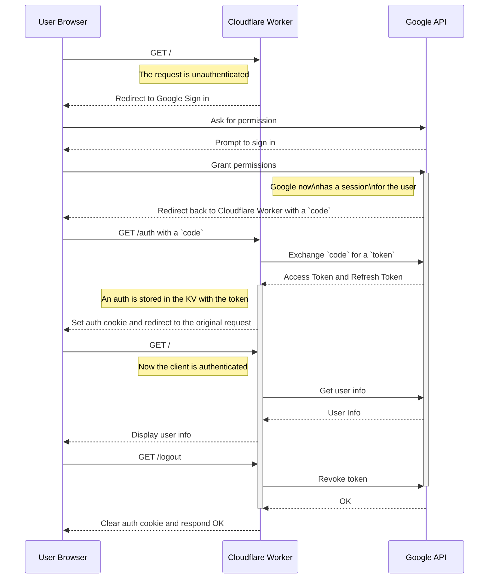

# ( ◕◡◕)っ Cloudflare Workers Google OAuth
This project is a **client application in the OAuth2 protocol** implemented using Cloudflare's serverless architecture (Workers). The corresponding authorization server and resource server in OAuth2 are provided by Google Cloud. This project is a fork of [jazcarate/cloudflare-worker-google-oauth](https://github.com/jazcarate/cloudflare-worker-google-oauth) with additional details in the project documentation and improvements made to Cloudflare Workers v3 CLI tools (Wrangler, C3).

**English** · [简体中文](./README.zh-CN.md)

## About Cloudflare Workers
Cloudflare Workers is a serverless computing platform that allows developers to run JavaScript code on Cloudflare's globally distributed network, enabling fast, scalable, and high-performance applications and functionalities. A Cloudflare account is required to use Workers. The Workers Free Plan supports up to 100,000 request responses per day, with each request response consuming up to 10 ms of CPU time. Cloudflare's [2024 billing model](https://blog.cloudflare.com/workers-pricing-scale-to-zero/) excludes I/O wait time, allowing most I/O-intensive web applications to run smoothly on the free plan.

> Cloudflare Workers provides a serverless execution environment that allows you to create new applications or augment existing ones without configuring or maintaining infrastructure.

> Cloudflare Workers let you deploy serverless code instantly across the globe for exceptional performance, reliability, and scale.

## About OAuth2
OAuth 2.0 is an authorization framework that allows third-party applications to obtain limited access to protected resources on a resource server with the permission of the resource owner, without exposing the resource owner's credentials. OAuth 2.0 is widely used in scenarios such as social login and API access control.

> The OAuth 2.0 authorization framework enables a third-party application to obtain limited access to an HTTP service, either on behalf of a resource owner by orchestrating an approval interaction between the resource owner and the HTTP service, or by allowing the third-party application to obtain access on its own behalf.

**Terminology**

1. **Authorization Server**:
   - Responsible for verifying the identity of the resource owner and issuing an access token to the client application.
     > In this project, the authorization service in the OAuth2 process is provided by the corresponding API endpoints of Google Cloud. (To be completed)

2. **Resource Server**:
   - The server hosting the resources, which uses the access token to determine whether to allow the client to access the protected resources.
     > In this project, the resource access service is provided by the corresponding API endpoints of Google APIs. (To be completed)

3. **Client**:
   - The third-party application requesting access to the protected resources. It operates on behalf of the resource owner but does not represent the resource owner's identity.
     > This project utilizes Workers

4. **Resource Owner**:
   - The entity that owns the protected resources, usually the end user.

## OAuth2 Client Worker Design Concept

### Request Sequence




1. 用户访问OAuth2 Client应用首页 `/` 路由，检查认证状态。   
2. 用户访问 `/login` 链接，重定向到 Google OAuth2 登录页面。   
3. 用户在 Google 登录并授权后，Google 返回授权码。
4. 授权码通过 `/auth` 路由交换获取令牌，存储并Setup Cookie。   
5. 用户再次访问 `/` 或 `/userinfo`，检查并处理认证状态。   
6. 用户登出时访问 `/logout`，撤销令牌并清除 Cookie。   

**Related Reading**
 - [Using OAuth 2.0 for Web Server Applications](https://developers.google.com/identity/protocols/oauth2/web-server)

- [RFC 6749: The OAuth 2.0 Authorization Framework](https://datatracker.ietf.org/doc/html/rfc6749)

- [Using OAuth 2.0 to Access Google APIs](https://developers.google.com/identity/protocols/oauth2)

- [Setting up OAuth 2.0](https://support.google.com/cloud/answer/6158849) on Google Cloud

## Project Scaffolding
As previously mentioned, Cloudflare Workers offer significant advantages in deployment, operations, and scalability. However, directly using their [Runtime APIs](https://developers.cloudflare.com/workers/runtime-apis/) for project development comes with the following risks:

**Potential Risks and Considerations**

1. **Lock-In Effect**:
   - **Vendor Lock-In**: Relying heavily on Cloudflare Workers and their specific APIs may lead to high costs when migrating to other platforms. Developers need to assess whether this dependency could limit the project's long-term development.

2. **Learning Curve**:
   - **Learning New Technology**: The development model and toolchain of Cloudflare Workers differ from traditional server development. Developers need time to learn and adapt. For new team members or outsourced developers, this might increase training costs.

### Development Framework: Hono
Considering the above risks, we looked for a development framework that effectively encapsulates and modularizes the Workers API to mitigate the **vendor lock-in** effect and offers a well-designed API to reduce the **learning curve** for developers. Hono is an ultra-fast, lightweight web framework designed for edge computing environments such as Cloudflare Workers, Deno, Bun, and AWS Lambda. It provides high-performance routing, flexible middleware support, and a clean API, significantly improving development efficiency and code quality. Hono uses the standard Web API, ensuring cross-platform compatibility and helping developers avoid vendor lock-in.

Moreover, Cloudflare's [official SDK project](https://github.com/cloudflare/workers-sdk) template also uses [Hono as the development framework](https://github.com/cloudflare/workers-sdk/blob/2893c1abe3daefb67a41adbba66bc038e39f8243/templates/worker-d1-api/package.json#L9-L11).

For more details, refer to the [Hono official documentation](https://hono.dev/docs/).

## Prerequisites
### nodejs
To avoid version conflicts, it is recommended to install the Node.js environment via conda. This project uses the LTS version v20.12.0 from July 2024. If you have not installed `conda` yet, you can download and install Miniconda or Anaconda from the following links:
   - [Miniconda](https://docs.conda.io/en/latest/miniconda.html)
   - [Anaconda](https://www.anaconda.com/products/distribution)

1. **Create and activate a new Conda environment** (optional but recommended to avoid affecting other environments):
   ```bash
   conda create -n node-lts
   conda activate node-lts
   ```     

2. **Add the Conda-Forge repository** (if not already added):
   ```bash
   conda config --add channels conda-forge
   ```

3. **Install the specified version of Node.js using Conda**:
   ```bash
   conda install -c conda-forge nodejs=20
   ```

4. **Verify the installation**:
   After installation, you can verify that Node.js and npm were successfully installed and check their versions:
   ```bash
   node -v
   npm -v
   ```

### wrangler
`wrangler` is a command-line tool for managing and deploying Cloudflare Workers. It quickly initializes new projects, supports local development and debugging, and deploys Workers to the Cloudflare edge network. `wrangler` manages configuration using the `wrangler.toml` file, supports the creation and management of Workers KV storage, and provides real-time log viewing. With `wrangler`, developers can efficiently develop, debug, and deploy code on Cloudflare, greatly simplifying the process.

<details>

<summary> <b> Wrangler Installation and Configuration </b> </summary>

- To install wrangler, run the following command in your project directory:
```bash
npm install wrangler --save-dev
```
- To verify the wrangler installation:
```bash
npx wrangler -v
```
- Configuration file `wrangler.toml`:
```
name = "oauth-client"
main = "src/index.ts"
compatibility_date = "2024-07-25"
```

</details>

### Google Cloud
- You will need a Google Services account.
  
- A Google OAuth Client ID and Secret, which can be created from [Credentials](https://console.cloud.google.com/apis/credentials) > + Create credentials > OAuth client ID > Application type: Web application.
  - Note: "Authorized redirect URIs"
    - For local development, use `http://127.0.0.1:8787/auth`
    - For production, use `[your Cloudflare worker URL]/auth`
  - After setup, record the generated `Client ID` and `Client secret`.

## Implementation
1. **Route**: `/` : Project Homepage
   - The user's request reaches the Worker, which checks the authentication cookie.
   - If not authenticated, it displays the `/login` link.
   - If authenticated, the token is used to call the Google Userinfo API.
2. **Route**: `/login` : Login Page
   - The user clicks the `/login` link, redirecting to Google's OAuth2 authorization URL with the `access_type=offline` parameter.
3. **Route**: `/auth` : Exchange Authorization Code for Tokens
   - After receiving the authorization code, the Worker exchanges it with Google API for access and refresh tokens.
   - Stores the token information and sets up the authentication cookie, then displays login success, waits 10 seconds, and redirects back to `/userinfo`.
4. **Route**: `/userinfo` : User Info Page
   - Checks the authentication cookie, and if there is a valid token, processes the user request, such as fetching user information.
5. **Route**: `/logout` : Revoke Token and Clear Cookie
   - Revokes the token, deletes the token data in KV, and clears the authentication cookie.

1. **Route**: `/` : Project Homepage
   - User request reaches the Worker, checks the authentication Cookie.
   - If not authenticated, displays the `/login` link.
   - If authenticated, use the Token to call the Google Userinfo API.
2. **Route**: `/login` : Login Page
   - User clicks the `/login` link, redirects to Google's OAuth2 authorization URL, requesting with `access_type=offline` parameter.
3. **Route**: `/auth` : Exchange Authorization Code for Tokens
   - After receiving the authorization code, the Worker exchanges it with Google API for access and refresh tokens.
   - 存储令牌信息并Setup认证 Cookie，然后显示登录成功， 等待10秒后重定向回 `/userinfo`。
4. **Route**: `/userinfo` : User Info Page
   - Checks the authentication Cookie, if there is a valid token, processes the user request, such as fetching user information.
5. **Route**: `/logout` : Revoke Token and Clear Cookie
   **Route**: `/logout`
   - Revokes the token, deletes the token data in KV, and clears the authentication Cookie.

## Deployment
### Local Development Environment
1. Create Project
   You can use Cloudflare's interactive command-line tool C3 (create-cloudflare-cli) to create the project.
   ```bash
   npm create cloudflare
   ```
   During the interaction, choose Worker built from a template hosted in a git repository, then use `https://github.com/crazynomad/cloudflare-worker-google-oauth`.

2. wrangler Configuration
   Configure `wrangler.toml`, where `name` is the worker's name and can be changed.
   ```toml
   name = "oauth-client"
   main = "src/index.ts"
   compatibility_date = "2024-07-25"
   ```

3. Environment Variables
   Use wrangler to set up the [OAuth Client ID and Client secret generated above](#google-cloud):
   ```bash
   npx wrangler secret put CLIENT_ID
   npx wrangler secret put CLIENT_SECRET
   npx wrangler secret put REDIRECT_URI
   ```

4. Setup Cloudflare KV
   Create a `KV` namespace:
   ```bash
   npx wrangler kv namespace create "authTokens"
   ```
   Add the corresponding configuration to the `wrangler.toml` file based on the returned value, for example:
   ```toml
   [[kv_namespaces]]
   binding = "authTokens"
   id = "cac2199813c246679f58a34ef915e138"

   [vars]
   LOCAL = true
   ```

5. Local Environment Variables
   Create a `.dev.vars` file, and add the following:
   ```plaintext
   LOCAL = true
   CLIENT_ID = "<Replace With your CLIENT ID>"
   CLIENT_SECRET = "<Replace With your CLIENT SECRET>"
   REDIRECT_URI = "http://127.0.0.1:8787/auth"
   ```
   Learn more about environment variables:
   - [Environment variables](https://developers.cloudflare.com/workers/configuration/environment-variables/)
   - [System environment variables](https://developers.cloudflare.com/workers/wrangler/system-environment-variables/)

6. Start
   ```bash
   npx wrangler dev
   ```
   Then visit http://127.0.0.1:8787, you should be automatically guided into the OAuth authorization process.

7. DONE!!!

### Production Deployment
1. Deploy to production using the `wrangler` tool:
   ```bash
   npx wrangler deploy
   ```

2. Log in to Cloudflare Dashboard, find your Worker under Workers & Pages, and copy its external `Worker URL`.

3. Edit the OAuth 2.0 Client ID generated in Google Cloud, adding an `Authorized redirect URI` with your [`Worker URL`/auth].

4. Visit the `Worker URL` in the browser, you should be automatically guided into the same OAuth authorization process as the local development environment.

5. Success!!!

## To Do List
- [ ] Add deploy to Cloudflare badge
- [x] Currently, the version of `@cloudflare/workers-types` used is low. If upgraded to v4, VS Code will report errors in the TypeScript file, so optimization is needed.

## Ideas to Grow This Project
If you would like to use this setup as a starting point to develop interesting things, I recommend trying out one (or all!) of these improvements:

- Create a middleware pattern to deal with authenticated and unauthenticated endpoints.
- Serve static content, either with Cloudflare Sites or by reading local files in a Worker. A default path could be implemented to serve files in the `public/` folder.
- Improve the rendered HTML with a template library, or roll up your own!
- Use another Google API from [the list](https://developers.google.com/workspace/products).