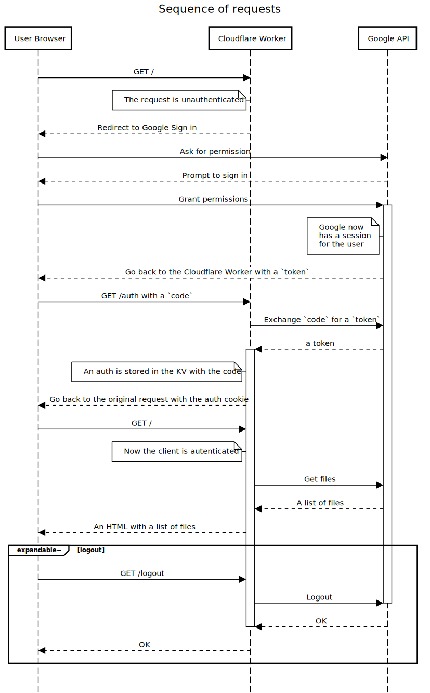

# ( ◕◡◕)っ Cloudflare Workers Google OAuth

This project is a **client application in the OAuth2 protocol** implemented using Cloudflare's serverless architecture (Workers). The authorization server and resource server in OAuth2 are provided by Google Cloud. This project forks from [jazcarate/cloudflare-worker-google-oauth](https://github.com/jazcarate/cloudflare-worker-google-oauth), with improvements to the project documentation and updates for Cloudflare Workers v3 CLI tools (Wrangler, C3).

**English** · [简体中文](./README.zh-CN.md) 

#### About Cloudflare Workers

Cloudflare Workers is a serverless computing platform that allows developers to run JavaScript code on Cloudflare's globally distributed network, enabling fast, scalable, and high-performance applications and functionalities. You need to register a Cloudflare account to use Workers. The free plan supports 100,000 requests per day, with up to 10 ms of CPU time per request. According to Cloudflare's [2024 billing model](https://blog.cloudflare.com/workers-pricing-scale-to-zero/), I/O wait time is excluded, allowing most I/O-intensive web applications to run smoothly on the free plan.

> Cloudflare Workers provides a serverless execution environment that allows you to create new applications or augment existing ones without configuring or maintaining infrastructure.

> Cloudflare Workers let you deploy serverless code instantly across the globe for exceptional performance, reliability, and scale.

#### OAuth2

OAuth 2.0 is an authorization framework that allows third-party applications to obtain limited access to protected resources on a resource server on behalf of the resource owner without exposing the resource owner's credentials. OAuth 2.0 is widely used in social login, API access control, and other scenarios.

> The OAuth 2.0 authorization framework enables a third-party application to obtain limited access to an HTTP service, either on behalf of a resource owner by orchestrating an approval interaction between the resource owner and the HTTP service, or by allowing the third-party application to obtain access on its own behalf.

**Terminology**

1. **Authorization Server**:
   - Responsible for verifying the identity of the resource owner and issuing access tokens to client applications.
     > In this project, the authorization service is provided by Google Cloud's API endpoints.

2. **Resource Server**:
   - Hosts the resources and uses access tokens to decide whether to allow client applications to access the protected resources.
     > In this project, the resource access service is provided by Google APIs' endpoints.

3. **Client**:
   - The third-party application requesting access to protected resources. It operates on behalf of the resource owner but does not act as the resource owner.
     > This project utilizes Workers.

4. **Resource Owner**:
   - The entity that owns the protected resources, usually the end-user.

<details>
  <summary>Sequence Diagram of OAuth2 requests</summary>
  
  
  
</details>

<details>
  <summary>Generated with <a href="https://sequencediagram.org/" target="_blank" rel="noopener noreferrer">sequencediagram.org</a></summary>
  <pre><code>title Sequence of OAuth2 requests

User Browser->Cloudflare Worker: GET /
note left of Cloudflare Worker: The request is unauthenticated
Cloudflare Worker-->User Browser: Redirect to Google Sign in
User Browser->Google API: Ask for permission
Google API-->User Browser: Prompt to sign in
User Browser->Google API: Grant permissions
activate Google API
note left of Google API: Google now\nhas a session\nfor the user
Google API-->User Browser: Go back to the Cloudflare Worker with a `token`
User Browser->Cloudflare Worker: GET /auth with a `code`
Cloudflare Worker->Google API: Exchange `code` for a `token`
Google API-->Cloudflare Worker: a token
activate Cloudflare Worker
note left of Cloudflare Worker: An auth is stored in the KV with the code
Cloudflare Worker-->User Browser: Go back to the original request with the auth cookie
User Browser->Cloudflare Worker: GET /
note left of Cloudflare Worker: Now the client is authenticated
Cloudflare Worker->Google API: Get files
Google API-->Cloudflare Worker: A list of files
Cloudflare Worker-->User Browser: An HTML with a list of files
expandable− logout
User Browser->Cloudflare Worker: GET /logout
Cloudflare Worker->Google API: Logout
deactivate Google API
Google API-->Cloudflare Worker: OK
deactivate Cloudflare Worker
Cloudflare Worker-->User Browser: OK
end
  </code></pre>
</details>

**Further Reading**
 - [Using OAuth 2.0 for Web Server Applications](https://developers.google.com/identity/protocols/oauth2/web-server).

- [RFC 6749: The OAuth 2.0 Authorization Framework](https://datatracker.ietf.org/doc/html/rfc6749) 

- [Using OAuth 2.0 to Access Google APIs](https://developers.google.com/identity/protocols/oauth2)

- [Setting up OAuth 2.0](https://support.google.com/cloud/answer/6158849) on Google Cloud

## Prerequisites
### Node.js
To avoid version conflicts, it is recommended to install the Node.js environment via Conda. This project uses the LTS version v20.12.0 from July 2024. If you haven't installed `conda` yet, you can download and install Miniconda or Anaconda from the following links:
   - [Miniconda](https://docs.conda.io/en/latest/miniconda.html)
   - [Anaconda](https://www.anaconda.com/products/distribution)

1. **Create and activate a new Conda environment** (optional but recommended to avoid impacting other environments):
   ```bash
   conda create -n node-lts
   conda activate node-lts
   ```     
2. **Add Conda-Forge repository** (if not already added):
   ```bash
   conda config --add channels conda-forge
   ```

3. **Install the specified version of Node.js using Conda**:
    `conda install -c conda-forge nodejs=20`
4. **Verify the installation**:
   After the installation is complete, you can verify if Node.js and npm were installed successfully and check their versions using the following commands:
   ```bash
   node -v
   npm -v
   ```

### wrangler
`wrangler` is a command-line tool used for managing and deploying Cloudflare Workers. It can quickly initialize new projects, develop and debug locally, and deploy Workers to Cloudflare's edge network. `wrangler` uses the `wrangler.toml` file to manage configuration, supports the creation and management of Workers KV storage, and provides real-time log viewing. With `wrangler`, developers can efficiently develop, debug, and deploy code on Cloudflare, greatly simplifying the operation process.

<details>

<summary> <b> wrangler installation and configuration </b> </summary>

- To install wrangler, execute in the project directory
```bash
npm install wrangler --save-dev
```
- Verify wrangler installation
```bash
npx wrangler -v
```
- Configuration file wrangler.toml
```
name = "oauth-client"
main = "src/index.ts"
compatibility_date = "2024-07-25"
```

</details>

### Google Cloud
- A Google Services account is required
  
- A Google OAuth Client ID and Secret, from the [Credentials](https://console.cloud.google.com/apis/credentials) > + Create credentials > OAuth client ID > Application type: Web application
  - Note: "Authorized redirect URIs"
    - For local development, you can use `http://127.0.0.1:8787/auth`
    - For production, use `[your cloudflare worker url]/auth`
  - After completing the setup, record the generated `Client ID` and `Client secret`

## Deployment
### Local Development Environment
1. Create a project
  You can use Cloudflare's interactive command-line tool C3 (create-cloudflare-cli) to create a project.
    ```
    npm create cloudflare
    ```
    During the interaction, select Worker built from a template hosted in a git repository, then use `https://github.com/crazynomad/cloudflare-worker-google-oauth`
1. wrangler configuration
  It is recommended to configure wrangler.toml, `name` is the name of the worker, which can be changed
    ```
    name = "oauth-client"
    main = "src/index.ts"
    compatibility_date = "2024-07-25"
    ```
1. Environment variables
Set the [OAuth Client ID and Client secret generated above](#google-cloud) using wrangler:
   `npx wrangler secret put CLIENT_ID`
   `npx wrangler secret put CLIENT_SECRET`

1. Set up Cloudflare Cache (KV)
  Create a `KV` namespace: `npx wrangler kv namespace create "OAuthTokens"` and add the corresponding configuration returned to the `wrangler.toml` file, for example
    ```
    [[kv_namespaces]]
    binding = "OAuthTokens"
    id = "cac2199813c246679f58a34ef915e138"

    [vars]
    LOCAL = true
    ```

1. Local environment variables
  Create a `.dev.vars` file and add
    ```
    LOCAL = true
    CLIENT_ID = "<Replace With your CLIENT ID>"
    CLIENT_SECRET = "<Replace With your CLIENT SECRET>"
    ```
    Learn more about environment variables
    - [Environment variables](https://developers.cloudflare.com/workers/configuration/environment-variables/)
    - [System environment variables](https://developers.cloudflare.com/workers/wrangler/system-environment-variables/)
1. Start
  `npx wrangler dev`
  Then visit http://127.0.0.1:8787, you should be automatically guided into the OAuth authorization process.
1. DONE!!!

### Production Deployment
1. Use the `wrangler` tool to deploy to the production environment
   `npx wrangler deploy`
2. Log in to the Cloudflare Dashboard, find your Worker under Workers & Pages, and copy its external access `Worker URL`
3. Edit the previously generated OAuth 2.0 Client ID in Google Cloud, add an `Authorized redirect URI`, and fill in your [`Worker URL`/auth]
4. Visit `Worker URL` in your browser, you should be automatically guided into the same OAuth authorization process as in the local development environment.
5. Success!!!

## Improvements Needed
Currently, the version of `@cloudflare/workers-types` used is relatively low. If upgraded to v4, VS Code will report errors in ts files, which need to be optimized.

## Ideas to grow this project
If you would like to use this setup as a starting point to develop interesting things; I recommend trying out one (or all!) of these improvements:

- Create a middleware pattern to deal with authenticated and unauthenticated endpoints
- Serve static content, either with Cloudflare Sites, or by reading local files in a Worker. A default path could be implemented to serve files in the `public/` folder.
- Improve the rendered HTML with a template library, or create your own!
- Use another Google API from [the list](https://developers.google.com/workspace/products).

   