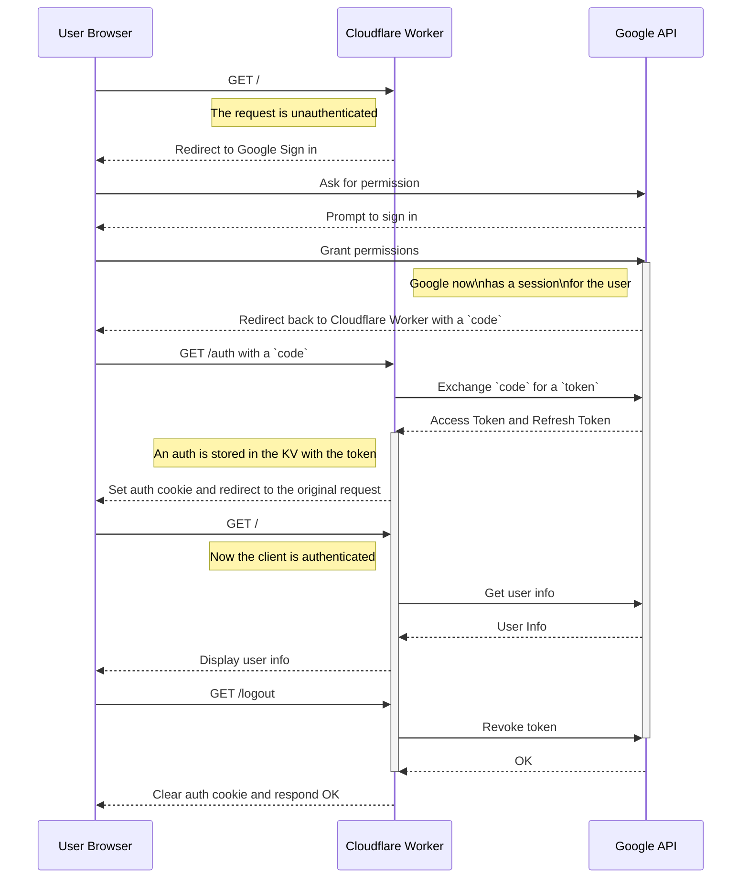

# ( ◕◡◕)っ Cloudflare Workers Google OAuth
本项目是一个利用 Cloudflare 提供的 Workers 无服务器架构（Serverless）实现的 **OAuth2 协议中的客户端（Client）应用**， OAuth2 中对应的授权服务器和资源服务器由 Google Cloud 进行提供。本项目fork [jazcarate/cloudflare-worker-google-oauth](https://github.com/jazcarate/cloudflare-worker-google-oauth) 并对项目文档细节进行了补充并Cloudflare Workers v3 版本的 CLI （Wrangler, C3）工具进行改进， 

[English](./README.md) · **简体中文**

## About Cloudflare Workers
Cloudflare Workers 是一种无服务器计算平台，允许开发者在全球分布的 Cloudflare 网络上运行 JavaScript 代码，从而实现快速、可扩展和高性能的应用和功能。需要注册一个 Cloudflare account 来使用 Workers, Workers 免费规格(Free Plan) 的 Workers 每日可支持 100,000 请求响应，每个请求响应消耗的的 CPU 时间可达10 ms。Cloudflare 【2024年公布的计费模型](https://blog.cloudflare.com/workers-pricing-scale-to-zero/)中排除了 I/O 等待的耗时， 使得多数I/O密集Web应用可以在免费规格上顺利的运行。
> Cloudflare Workers provides a serverless execution environment that allows you to create new applications or augment existing ones without configuring or maintaining infrastructure.

> Cloudflare Workers let you deploy serverless code instantly across the globe for exceptional performance, reliability, and scale.

## About OAuth2
OAuth 2.0 是一种授权框架，允许第三方应用在资源所有者的许可下，获取访问资源服务器上的受保护资源的权限，而不需要暴露资源所有者的凭据。OAuth 2.0 被广泛应用于社交登录、API 访问控制等场景。

> The OAuth 2.0 authorization framework enables a third-partyapplication to obtain limited access to an HTTP service, either on behalf of a resource owner by orchestrating an approval interaction between the resource owner and the HTTP service, or by allowing the third-party application to obtain access on its own behalf.

**名词解释**

1. **授权服务器（Authorization Server）**：
   - 负责验证资源所有者的身份，并颁发访问令牌（Access Token）给客户端应用。
     > 在本项目中由 Google Cloud 的相应API endpoints 来提供 OAuth2 业务流程中的授权服务。（待完善）

2. **资源服务器（Resource Server）**：
   - 托管资源的服务器，使用访问令牌来决定是否允许客户端访问受保护资源。
     > 在本项目中由 Google APIs 的相应API endpoints 来提供对应的资源访问服务。（待完善）

3. **客户端（Client）**：
   - 请求访问受保护资源的第三方应用。它代表资源所有者操作，但并不代表资源所有者的身份。
     > 本项目利用Workers

4. **资源所有者（Resource Owner）**：
   - 拥有受保护资源的实体，通常是最终用户。

## OAuth2 Client Worker 设计思路

### 请求时序



1. 用户访问OAuth2 Client应用首页 `/` 路由，检查认证状态。   
2. 用户访问 `/login` 链接，重定向到 Google OAuth2 登录页面。   
3. 用户在 Google 登录并授权后，Google 返回授权码。
4. 授权码通过 `/auth` 路由交换获取令牌，存储并设置 Cookie。   
5. 用户再次访问 `/` 或 `/userinfo`，检查并处理认证状态。   
6. 用户登出时访问 `/logout`，撤销令牌并清除 Cookie。   

**相关阅读**
 - [Using OAuth 2.0 for Web Server Applications](https://developers.google.com/identity/protocols/oauth2/web-server).

- [RFC 6749: The OAuth 2.0 Authorization Framework ](https://datatracker.ietf.org/doc/html/rfc6749) 

- [Using OAuth 2.0 to Access Google APIs](https://developers.google.com/identity/protocols/oauth2)

- [Setting up OAuth 2.0](https://support.google.com/cloud/answer/6158849) on Google Cloud

## 项目脚手架
如前所述 Cloudflare Workers 在部署/运维/可扩展性上存在很大的优势， 但是如果直接使用其提供的 [Runtime APIs](https://developers.cloudflare.com/workers/runtime-apis/) 进行项目开发则存在以下风险


**潜在风险和注意事项**

1. **锁定效应**：
   - **供应商锁定**：过于依赖 Cloudflare Workers 及其特有的 APIs 可能导致迁移到其他平台时成本较高。开发者需要评估这种依赖是否会对项目的长期发展造成限制。

2. **学习成本**：
   - **新技术学习**：Cloudflare Workers 的开发模式和工具链与传统服务器开发有所不同，开发人员需要时间学习和适应。对于团队中的新成员或外包开发人员，这可能会增加培训成本。


### 开发框架 hono
考虑到以上风险，我们寻找一个能够对 Workers API 进行有效封装和模块化， 能够适当缓解**供应商锁定**效应的开发框架， 并且拥有一个设计良好 API 来降低开发人员的**学习成本**。 
Hono 是一个超快速、轻量级的 Web 框架，专为边缘计算环境设计，如 Cloudflare Workers、Deno、Bun 和 AWS Lambda。它提供高性能路由、灵活的中间件支持和简洁的 API，极大地提高了开发效率和代码质量。Hono 使用标准 Web API，具有跨平台兼容性，帮助开发者避免供应商锁定。
而且 Cloudflare 的[官方SDK 项目](https://github.com/cloudflare/workers-sdk)模版中， 也采用了 [hono 作为项目的开发框架](https://github.com/cloudflare/workers-sdk/blob/2893c1abe3daefb67a41adbba66bc038e39f8243/templates/worker-d1-api/package.json#L9-L11)。


更多详情可参考 [Hono 官方文档](https://hono.dev/docs/).


## 开发环境准备 
### nodejs
为了避免版本冲突建议通过 conda 进行 nodejs 环境安装, 本项目使用 2024-07 月间的 LTS 版本 v20.12.0
如果还没有安装 `conda`，可以从以下链接下载并安装 Miniconda 或 Anaconda：
   - [Miniconda](https://docs.conda.io/en/latest/miniconda.html)
   - [Anaconda](https://www.anaconda.com/products/distribution)

1. **创建并激活一个新的 Conda 环境**（可选，但推荐这样做，以避免影响其他环境）:
   ```bash
   conda create -n nodee-lts
   conda activate nodee-lts
   ```     

2. **添加 Conda-Forge 仓库**（如果还没有添加过）:
   ```bash
   conda config --add channels conda-forge
   ```

3. **使用 Conda 安装 Node.js 的 认定版本**:

```bash
conda install -c conda-forge nodejs=20
```
4. **验证安装**:
   安装完成后，可以通过以下命令验证 Node.js 和 npm 是否安装成功，以及它们的版本：
   ```bash
   node -v
   npm -v
   ```


### wrangler
`wrangler` 是一个用于管理和部署 Cloudflare Workers 的命令行工具。它能快速初始化新项目、本地开发和调试、部署 Workers 到 Cloudflare 边缘网络。`wrangler` 使用 `wrangler.toml` 文件管理配置，支持 Workers KV 存储的创建和管理，并提供实时日志查看功能。通过 `wrangler`，开发者可以高效地在 Cloudflare 上开发、调试和部署代码，极大地简化了操作流程。


<details>

<summary> <b> wrangler 安装以及配置 </b> </summary>

- wrangler 安装，请在项目目录当中执行
```bash
npm install wrangler --save-dev
```
- 验证 wrangler 安装
```bash
npx wrangler -v
```
- 配置文件 wrangler.toml
```
name = "oauth-client"
main = "src/index.ts"
compatibility_date = "2024-07-25"
```

</details>


### Google Cloud
- 需要一个 Google Services account
  
- A Google OAuth Client ID and Secret, from the [Credentials](https://console.cloud.google.com/apis/credentials) > + Create credentials > Oauh client ID. > Application: Web application
  - 注意: "Authorized redirect URIs"
    - 本地开发时可使用 `http://127.0.0.1:8787/auth`
    - 生产环境时应使用 `[your cloudflare worker url]/auth` 
  - 完成设置后需要需要记录生成的 `Client ID` 和 `Client secret`

## 具体实现
1. **路由**：`/` ： 项目首页   
   - 用户请求到达 Worker，检查认证 Cookie。
   - 如果未认证，显示 `/login` 链接。
   - 如果认证，利用Token 调用Google Userinfo API。
   https://github.com/crazynomad/cloudflare-worker-google-oauth/blob/5026fb742ccc4ee7383229da15586555eef2218e/src/index.ts#L227-L261   
2. **路由**：`/login` ：登录页 
   - 用户点击 `/login` 链接，重定向到 Google 的 OAuth2 授权 URL，请求包含 `access_type=offline` 参数。
   https://github.com/crazynomad/cloudflare-worker-google-oauth/blob/5026fb742ccc4ee7383229da15586555eef2218e/src/index.ts#L81-L127   
3. **路由**：`/auth`：授权码交换令牌   
   - Worker 接收到授权码后，与 Google API 交换获取访问令牌和刷新令牌。
   - 存储令牌信息并设置认证 Cookie，然后显示登录成功， 等待10秒后重定向回 `/userinfo`。
   https://github.com/crazynomad/cloudflare-worker-google-oauth/blob/5026fb742ccc4ee7383229da15586555eef2218e/src/index.ts#L134-L192   
4. **路由**：`/userinfo`： 用户信息页   
   - 检查认证 Cookie，如果存在有效令牌，则处理用户请求，如获取用户信息。
   https://github.com/crazynomad/cloudflare-worker-google-oauth/blob/5026fb742ccc4ee7383229da15586555eef2218e/src/index.ts#L198-L221
5. **路由**：`/logout`：撤销令牌并清除 Cookie   
   - 撤销令牌，删除 KV 中的令牌数据，并清除认证 Cookie。
   https://github.com/crazynomad/cloudflare-worker-google-oauth/blob/5026fb742ccc4ee7383229da15586555eef2218e/src/index.ts#L267-L279


## 部署
### 本地开发环境
1. 创建项目
  可以使用 Cloudflare 提供的交互命令行工具 C3 (create-cloudflare-cli) 进行项目创建.
    ```
    npm create cloudflare
    ```
    交互过程中选择 Worker built from a template hosted in a git repository, 然后使用 `https://github.com/crazynomad/cloudflare-worker-google-oauth`
1. wrangler 配置
  建议 wrangler.toml 配置， `name` 是 worker 的名称，可自行更改
    ```
    name = "oauth-client"
    main = "src/index.ts"
    compatibility_date = "2024-07-25"
    ```
1. 环境变量是指
使用 wrangler 设置[上文生成 OAuth Client ID 和 Client secret](#google-cloud):
    `npx wrangler secret put CLIENT_ID`
    `npx wrangler secret put CLIENT_SECRET`
    `npx wrangler secret put REDIRECT_URI`
1. 设置Cloudflare 缓存(KV)
  创建 `KV` namespace: `npx wrangler kv namespace create "authTokens"` 并根据返回值在 `wrangler.toml` 文件中追加对应配置， 例如
    ```
    [[kv_namespaces]]
    binding = "authTokens"
    id = "cac2199813c246679f58a34ef915e138"

    [vars]
    LOCAL = true
    ```

1. 本地环境变量
  创建一个 `.dev.vars` 的文件，其中添加
    ```
    LOCAL = true
    CLIENT_ID = "<Replace With your CLIENT ID>"
    CLIENT_SECRET = "<Replace With your CLIENT SECRET>"
    REDIRECT_URI = "http://127.0.0.1:8787/auth"
    ```
    了解更多环境变量相关内容
    - [Environment variables](https://developers.cloudflare.com/workers/configuration/environment-variables/)
    - [System environment variables](https://developers.cloudflare.com/workers/wrangler/system-environment-variables/)
1. 启动
  `npx wrangler dev`
  然后访问 http://127.0.0.1:8787 ， 应该可以自动被引导进入 OAuth 授权流程。
1. DONE ！！！

### 线上部署
1. 利用 `wrangler` 工具部署至线上环境
   `npx wrangler deploy`
2. 登陆 Cloudflare Dashboard, 在 Workers & Pages 下面找到你的 Worker, 复制其外部访问的 `Worker URL` 
3. 编辑之前在 Google Cloud 的 生成的 OAuth 2.0 Client ID, 追加一个 `Authorized redirect URI`, 填入你的 [`Worker URL`/auth]
4. 在浏览器中访问 `Worker URL`， 应该可以自动被引导进入和本地开发环境相同的 OAuth 授权流程。
5. Success ！！！

## To Do List
- [ ] Add deploy to Cloudflare 的图标
- [x] 目前 `@cloudflare/workers-types` 使用的版本较低， 如果提升到 v4 则 VS Code 会在 ts文件中报错， 需要进行优化。

## Ideas to grow this project
If you would like to use this setups as a starting point to develop interesting things; I recommend trying out one (or all!) of this improvements:

- Create a middleware pattern to deaal with authenticated and unauthenticated endpoints
- Serve static content, either with Cloudflare Sites, or reading local files in a Worker. A default path could be implemented to serve files in `public/` folder.
- Improve the rendered HTML with a template library, or roll up your own!
- Use another Google API from [the list](https://developers.google.com/workspace/products).


