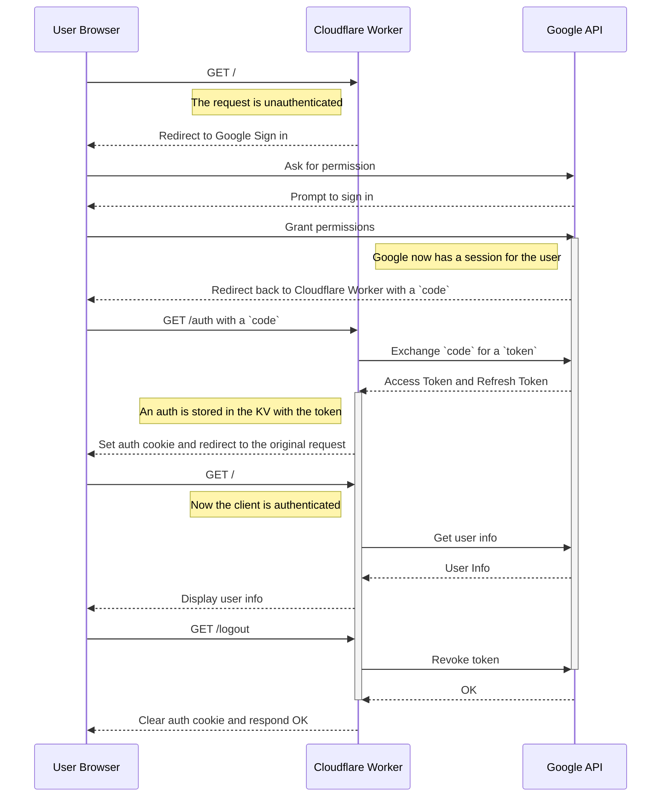

# OAuth2 Client Worker 设计思路

## 请求时序

## 路由说明
1. 用户访问OAuth2 Client应用首页 `/` 路由，检查认证状态。   
2. 用户访问 `/login` 链接，重定向到 Google OAuth2 登录页面。   
3. 用户在 Google 登录并授权后，Google 返回授权码。
4. 授权码通过 `/auth` 路由交换获取令牌，存储并设置 Cookie。   
5. 用户再次访问 `/` 或 `/userinfo`，检查并处理认证状态。   
6. 用户登出时访问 `/logout`，撤销令牌并清除 Cookie。
